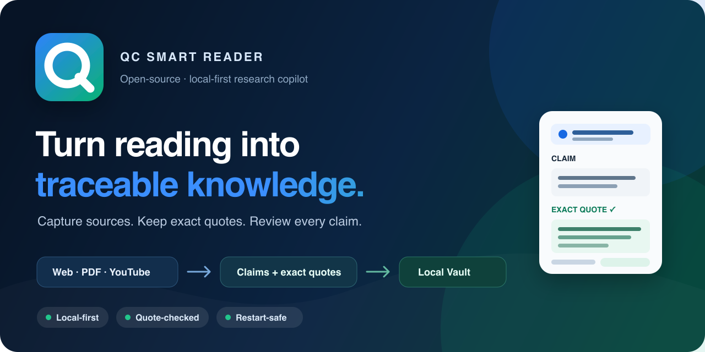
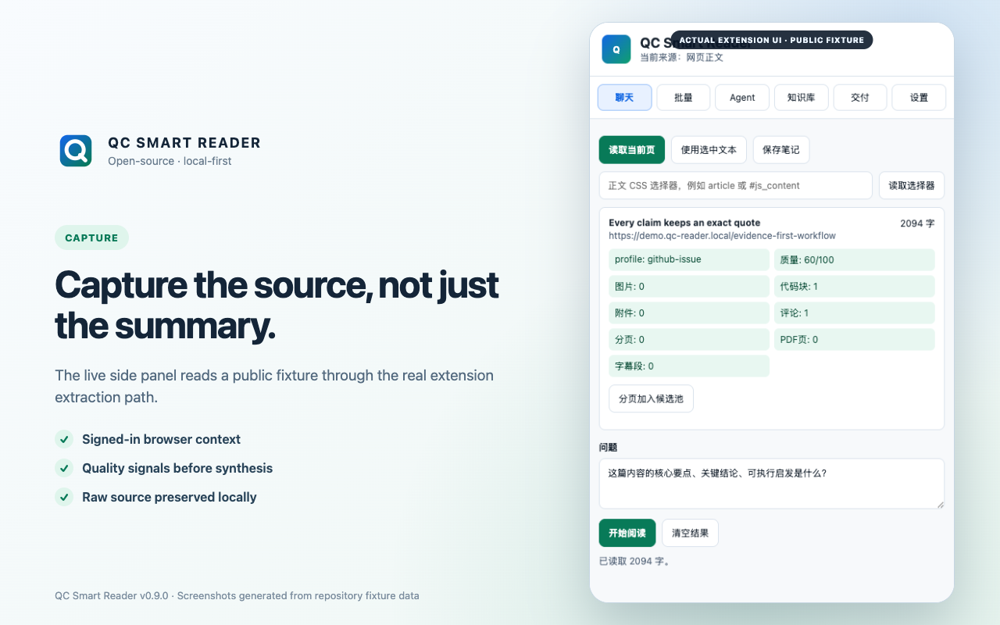
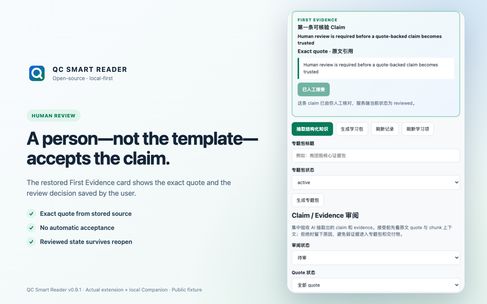
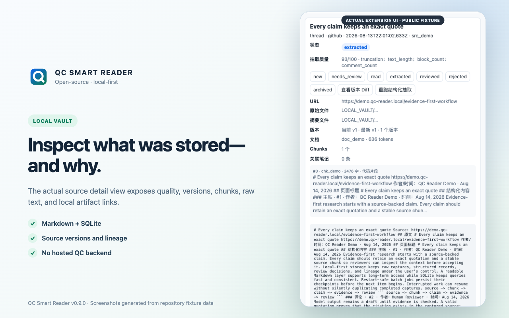

# QC Smart Reader



[](https://github.com/vyang472/qc-smart-reader-extension/actions/workflows/ci.yml)
[](https://github.com/vyang472/qc-smart-reader-extension/releases/latest)
[](LICENSE)
[](manifest.json)

**English · [简体中文](README.zh-CN.md)**

Turn web pages, PDFs, and public YouTube captions into quote-backed claims in a local evidence graph.

QC Smart Reader is a macOS-first Chrome extension and local Python companion. It captures research in your live browser session, stores it as SQLite plus readable Markdown, and makes every reviewed claim point back to an exact quotation. Use it with Codex CLI, an OpenAI-compatible or Anthropic endpoint, or no model at all.

> The model may summarize. The evidence decides what can be trusted.

## See it in action

| Capture in your browser | Review the exact evidence | Keep a durable local Vault |
| --- | --- | --- |
|  |  |  |

The three overview screenshots above were captured from the reviewed v0.9.1 extension and local Companion using a public deterministic fixture, so they retain that release's Simplified Chinese interface. The current v0.9.4 Web Store captures were regenerated twice from independent clean profiles against the real v0.9.4 Companion: [English pending review](store-assets/web-store/en-US/01-first-evidence-pending-review.png), [English reviewed Replay](store-assets/web-store/en-US/02-reviewed-exact-quote.png), [Simplified Chinese pending review](store-assets/web-store/zh-CN/01-first-evidence-pending-review.png), and [Simplified Chinese reviewed Replay](store-assets/web-store/zh-CN/02-reviewed-exact-quote.png). They show an undecided exact-quote claim followed by the same service-backed Replay record, source version, and human decision restored after reopening the side panel. Because v0.9.4 changes only the Settings setup CTA, these First Evidence pixels remain identical to the reviewed v0.9.3 captures.

> **v0.9.4 interface coverage:** setup, pairing, Quick Start, core current-page feedback, First Evidence, and Source Replay controls are available in English and Simplified Chinese. The interface follows the browser language by default and also offers Auto, English, and 简体中文 choices. Advanced Batch, Agents, most of Knowledge, Deliverables, and project/model controls remain in Simplified Chinese and are labeled accordingly.

## Why it is different

- **Evidence before fluency.** A claim cannot become `reviewed` unless its `source_id`, `chunk_id`, and exact quote still match the stored source text.
- **Staleness is automatic.** Re-capturing changed material invalidates mismatched evidence and marks dependent topic packages and deliverables stale.
- **Local-first by default.** The companion binds to loopback, uses a pairing token, and stores the research record on your Mac. Model use is optional and requires explicit consent.
- **Your signed-in browser does the capture.** Batch jobs reuse the Chrome session you already control and retain item-level status, leases, heartbeats, retries, and restart recovery.
- **Auditable outputs.** Reports, deck outlines, video scripts, and strategy briefs retain their path back through claims and evidence to the source.
- **Replay the captured record.** Reopen evidence against its saved context, locator, source version, and exact quote. Replay reports stale or unresolved records explicitly and never invents a live-page position.
- **No API key required to try it.** Deterministic local template extraction creates a draft claim whose exact quote comes from the captured source. It is not an AI summary and remains undecided until a person marks it supported or unsupported. Codex CLI and direct API providers remain optional.

## Install v0.9.4

The supported release path currently targets **macOS and Chrome 116+**. Core setup, First Evidence, and Replay controls are available in English and Simplified Chinese; advanced workspaces remain in Simplified Chinese.

Before starting, make sure the Mac has **Python 3.9+**, Chrome 116+, and internet access for the first Companion install to download its hash-pinned Python wheels. Codex CLI, `yt-dlp`, and the Swift toolchain are optional and only enable their corresponding model, public-caption, and OCR paths.

1. After the v0.9.4 GitHub Release is published, download these three files from [QC Smart Reader v0.9.4](https://github.com/vyang472/qc-smart-reader-extension/releases/tag/v0.9.4):
   - `qc-smart-reader-companion-0.9.4.zip`
   - `qc-smart-reader-extension-0.9.4.zip`
   - `SHA256SUMS`
2. In the download directory, run `shasum -a 256 -c SHA256SUMS` and confirm that both ZIPs report `OK`.
3. Extract the Companion ZIP, then double-click `install.command` (or run `bash install.command`). It installs a per-user background service, verifies readiness, and copies the Pairing Token.
4. Extract the Extension ZIP. Open `chrome://extensions`, enable **Developer mode**, choose **Load unpacked**, and select the extracted folder containing `manifest.json`.
5. Open the QC Smart Reader side panel. Leave **Interface language** on **Auto (browser)** or choose English / 简体中文. Settings also shows a direct **Download Companion v0.9.4** link and the matching `SHA256SUMS` link, both derived from the installed extension version. Enter `http://127.0.0.1:37621`, paste the Pairing Token, and choose **Test local Companion / 测试本地服务**. The protected projects API must accept the token before onboarding is unlocked.
6. Open a normal article and run Quick Start from **Read / 聊天**. First Evidence shows three user steps: connect the Companion, capture this page, then review and save. QC Smart Reader saves the page to the Vault, runs deterministic local template extraction internally, and shows one draft claim beside an exact source quote. Mark it supported only when the quote supports it, or unsupported when it does not. Choose **Replay** to inspect that quote in the captured context; reopening the side panel restores the server-backed evidence, Replay target, and decision.

Quick Start never calls an external model, even when one is configured. Its template draft is deliberately simple and is not an AI summary; the quote is copied from the stored source, and the claim remains pending until you mark it supported (`reviewed`) or unsupported (`rejected`). To use a model for other extraction or agent actions, select one route in **设置 → 模型设置**:

- **Codex CLI:** uses the locally installed, signed-in `codex` command; no separate API key is required by QC Smart Reader.
- **OpenAI-compatible or Anthropic:** uses the endpoint and API key you provide.
- **Local template (Mock):** the zero-configuration default; keeps extraction local and blocks model-only chat actions.

For source checkouts, upgrades, recovery, uninstall, and troubleshooting, see [从零到能用](上手指南.md).

## The evidence chain

```text
Chrome capture / PDF / captions
              │
              ▼
      source → chunk → exact quote
                          │
                          ▼
                       claim
                          │
                          ▼
           topic package → deliverable
```

The extension sends authenticated requests only to the loopback companion. The companion keeps a queryable SQLite index and a plain Markdown Vault under `~/Documents/QC Smart Reader Vault/`. Optional model calls are made by the companion to the provider the user selected; source material included in that action then leaves the device under that provider's terms.

## What v0.9.4 handles

| Workflow | Current behavior |
| --- | --- |
| Web capture | Current page, selected text, and recoverable URL batches using the live Chrome session |
| Site extraction | Dedicated profiles for common forums and publishing sites, plus a generic page profile |
| PDFs | Text-layer extraction with page citations; low-text pages can use macOS Vision OCR |
| YouTube | Manual captions or public captions discovered through an existing `yt-dlp`; no audio transcription or cookie import |
| Knowledge | Entities, claims, evidence, relations, assumptions, risks, tasks, review history, merge/split, quote re-validation, and Source Replay from the captured record |
| Outputs | Evidence-backed topic packages, reports, deck outlines, video scripts, and strategy handoffs |
| Integrity | Fail-closed Replay states, Vault Doctor, lineage rebuild, source versioning, stale propagation, deterministic release archives, and upgrade rollback |

## Trust and privacy boundaries

- The project is single-user and local-only; it has no hosted QC Smart Reader account or cloud sync.
- The companion listens on `127.0.0.1` by default and requires a random pairing token for data APIs.
- Web content is untrusted input. Provider output is also untrusted until its evidence passes validation.
- Local PDF imports are restricted to allowed directories. Remote PDF and caption fetches reject private, loopback, link-local, and reserved network targets.
- QC Smart Reader does not bypass paywalls, import browser cookies for captions, or transcribe video audio.
- The Vault contains the user's research material. Back up both `vault/` and `state/`; Markdown alone does not preserve every relationship and review state.

Read the complete [Privacy Policy](PRIVACY.md) and [Security Policy](SECURITY.md) before using sensitive material.

## Known limits

- The installer, background service lifecycle, and scanned-PDF OCR path are macOS-first. Windows and Linux packaging are not yet supported.
- v0.9.4 provides bilingual core onboarding, First Evidence, and Replay controls. Advanced Batch, Agents, most Knowledge and Deliverables views, and project/model controls remain in Simplified Chinese and show that boundary in the English interface.
- Replay is anchored to the locally captured snapshot. Its canonical-source link does not guarantee a precise position on the current remote page, and ambiguous or missing quote matches remain unresolved.
- Installation uses Chrome Developer mode until a Chrome Web Store release is approved.
- Complex PDF layouts, tables, figures, and formulas may need manual review.
- Public YouTube captions depend on an existing `yt-dlp`; private captions and audio transcription are out of scope.
- Batch capture needs Chrome to remain available because the extension is the browser executor.

See [ROADMAP.md](ROADMAP.md) for planned work and explicit non-goals.

## Development and verification

```bash
git clone https://github.com/vyang472/qc-smart-reader-extension.git
cd qc-smart-reader-extension
bash scripts/test_all.sh
```

The release gate checks Python, JavaScript, and shell syntax; Python service behavior; launcher and macOS install/upgrade/rollback/uninstall lifecycles; site-profile and side-panel behavior; real Chromium extension capture and restart recovery; and a temporary-Vault end-to-end evidence chain. Browser prerequisites are strict: a missing or failed Chromium run fails the gate instead of being silently skipped.

Release archives are built from an explicit allowlist with stable order, timestamps, permissions, and SHA-256 checksums:

```bash
python3 scripts/release.py --check
python3 scripts/release.py
shasum -a 256 -c dist/release/SHA256SUMS
```

## Contributing

Issues and focused pull requests are welcome. Start with [CONTRIBUTING.md](CONTRIBUTING.md), use [GitHub Discussions](https://github.com/vyang472/qc-smart-reader-extension/discussions) for design questions, and report vulnerabilities privately as described in [SECURITY.md](SECURITY.md).

If QC Smart Reader makes your research easier to verify, a GitHub star helps other local-first researchers find it. More importantly, tell us which source, claim-review, or installation workflow still breaks for you.

## License

[MIT](LICENSE) © Vincent Yang and contributors.
