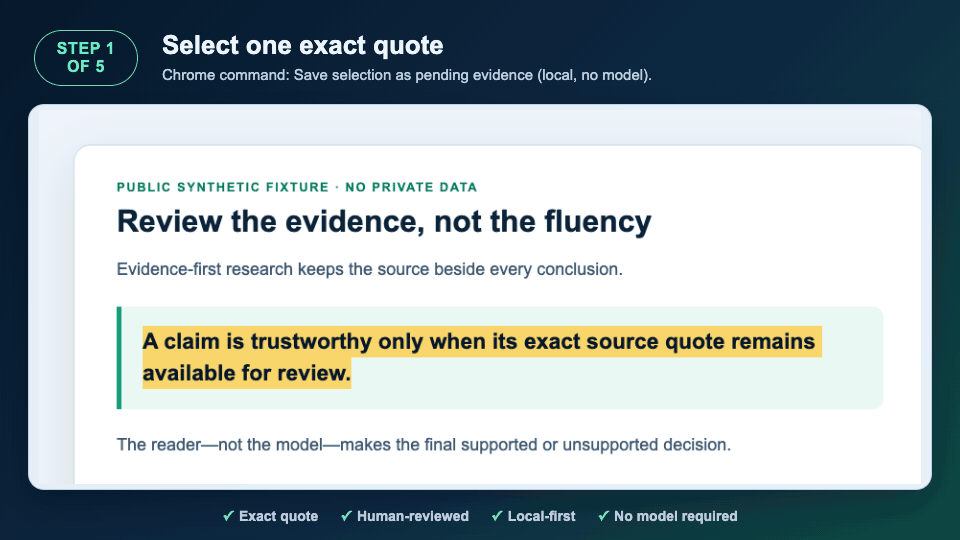

# QC Smart Reader


[](https://github.com/vyang472/qc-smart-reader-extension/actions/workflows/ci.yml)
[](https://github.com/vyang472/qc-smart-reader-extension/releases/latest)
[](LICENSE)
[](manifest.json)

**[English](README.md) · 简体中文**

把网页、PDF 和 YouTube 公开字幕变成带原文 quote 的 claim，并沉淀进本地证据图谱。

QC Smart Reader 是一个 **macOS 优先**的 Chrome 扩展 + 本地 Python Companion。它复用你正在使用的浏览器会话采集材料，把内容保存为 SQLite 与可直接阅读的 Markdown，并要求每条已审 claim 都能回到原文中的精确引用。你可以接 Codex CLI、OpenAI-compatible / Anthropic，也可以完全不配模型。

> 模型可以总结；证据决定这句话能不能信。

> **用约 15 分钟试一次证据核验——macOS + Chrome，不需要 API Key 或模型。**
>
> [先看 v0.9.5 已验收证据闭环演示](store-assets/demo/selection-first-evidence.gif) · [参加 v0.9.5 可用性测试，并按页面中的环境模板回复](https://github.com/vyang472/qc-smart-reader-extension/discussions/4)

## 看一段 exact quote 如何成为已审证据



_演示使用真实 v0.9.5 扩展与 Companion、干净浏览器 profile 和公开合成 fixture 生成。自动化录制无法显示 Chrome 原生右键菜单，因此开场画面会如实标出该命令；随后脚本针对真实 DOM 选区派发已安装扩展的生产环境 context-menu listener，画面中的产品状态均由 Companion 真实记录生成。全程没有模型或 Agent 运行，也不代表 Chrome Web Store 已批准。_

## 更多已验收界面

| 在浏览器里采集 | 对照原文审证据 | 保留可迁移的本地 Vault |
| --- | --- | --- |
|  |  |  |

<details>
<summary>这些界面图如何完成验收</summary>

上方三张总览图来自已验收的 v0.9.1 扩展与本地 Companion，使用公开、确定性 fixture 生成，因此保留该版本的简体中文界面。[英文待审](store-assets/web-store/en-US/01-first-evidence-pending-review.png)、[英文已审 Replay](store-assets/web-store/en-US/02-reviewed-exact-quote.png)、[简体中文待审](store-assets/web-store/zh-CN/01-first-evidence-pending-review.png)和[简体中文已审 Replay](store-assets/web-store/zh-CN/02-reviewed-exact-quote.png)均使用 v0.9.5 扩展、真实 v0.9.5 Companion 与公开确定性 fixture，在两个独立干净浏览器 profile 中重新生成。两次运行都逐字节复现了仓库中的 PNG，并通过 Replay 契约、敏感数据、布局、640×400 RGB 与确定性哈希校验。它们展示 Quick Start 的待审/已审 Replay 状态，不展示新的右键选中文本流程，也不能证明 v0.9.5 已上传、提交或通过 Chrome Web Store 审核。

</details>

> **v0.9.5 界面覆盖：**首次设置、配对、Quick Start、当前页核心反馈、选中文本保存、First Evidence 与 Source Replay 控件已支持 English / 简体中文；默认跟随浏览器语言，也可选择 Auto、English 或简体中文。批量、Agent、大部分知识库、交付以及项目/模型控制仍保持中文，并在英文界面明确提示。

## 它和普通 AI 阅读器有什么不同

- **先证据，后结论。** claim 只有在 `source_id + chunk_id + quote` 仍能逐字命中当前原文时，才能进入 `reviewed`。
- **来源变了，下游会自动过期。** 同一来源重新采集后，失效引用会让相关 claim 回退，并把专题包、交付物标成 stale。
- **默认本地。** Companion 只监听 loopback，用随机 Pairing Token 鉴权；Vault 在你的 Mac 上。模型是可选项，首次发送材料前必须明确同意。
- **直接复用你的 Chrome 登录态。** 批量任务由扩展执行，服务端记录每条 URL 的 lease、heartbeat、重试和恢复状态。
- **交付物可追溯。** 研究报告、PPT 大纲、视频脚本与策略任务书都能沿 claim / evidence 回到来源。
- **回放当时捕获的记录。** 从已保存的上下文、定位、来源版本与 exact quote 重新查验 evidence。Replay 会明确报告 stale 或 unresolved，不会伪造远程页面的精确位置。
- **不用模型，直接保存一段精确选文。** 选中文本后右键，显式保存为本地待核验证据。quote 会一直保持 pending，直到你人工接受或拒绝；保存动作不会调用 Codex CLI、API 模型或 Agent。
- **不用 API Key 也能试完整链路。** 确定性的本地模板会生成一条草稿 claim，exact quote 取自已保存原文。它不是 AI 总结；草稿会保持待定，直到你人工判断为支持或不支持。Codex CLI 与直连 API 都只是可选路线。

## 安装 v0.9.5

当前正式支持路径是 **macOS + Chrome 116+**。首次设置、First Evidence 与 Replay 控件已支持 English / 简体中文，高级工作台仍为简体中文。

开始前请确认 Mac 上已有 **Python 3.9+**、Chrome 116+，并能在首次安装 Companion 时联网下载经过 hash 锁定的 Python wheels。Codex CLI、`yt-dlp` 与 Swift 工具链都是可选依赖，只分别影响对应的模型、公开字幕与 OCR 路线。

1. 从已公开的 [QC Smart Reader v0.9.5 Release](https://github.com/vyang472/qc-smart-reader-extension/releases/tag/v0.9.5) 下载三个文件：
   - `qc-smart-reader-companion-0.9.5.zip`
   - `qc-smart-reader-extension-0.9.5.zip`
   - `SHA256SUMS`
2. 在下载目录运行 `shasum -a 256 -c SHA256SUMS`，确认两个 ZIP 都显示 `OK`。
3. 解压 Companion ZIP，双击 `install.command`（也可以运行 `bash install.command`）。安装器会安装当前用户的后台服务、验证可用性，并把 Pairing Token 复制到剪贴板。
4. 解压 Extension ZIP。打开 `chrome://extensions`，开启**开发者模式**，点击**加载已解压的扩展程序**，选择包含 `manifest.json` 的目录。
5. 打开 QC Smart Reader 侧边栏，让**界面语言**保持**自动（浏览器）**，或选择 English / 简体中文。设置页也会根据已安装扩展版本显示 **下载 Companion v0.9.5** 与对应的 `SHA256SUMS` 直达链接。填入 `http://127.0.0.1:37621`，粘贴 Pairing Token，点击 **Test local Companion / 测试本地服务**。只有 token 通过受保护的 projects API 鉴权后，首次使用流程才会解锁。如果旧 Companion 没有声明 `selection_first_evidence_v1`，扩展会保留待处理选文，并提示安装同版 v0.9.5 Companion。
6. 在普通 HTTP(S) 文章中选中不超过 800 个 Unicode 字符，右键选择 **将选中文本保存为待核验证据（仅本地，不调用模型）**。这一明确动作会把一段 exact quote 与有界上下文保存到本地 Companion，并以 pending First Evidence 打开。对照 claim 与 quote 后，再人工选择支持（`reviewed`）或不支持（`rejected`）。保存本身不会替你判断，也不会调用模型或 Agent。
7. 需要从整页开始时，仍可从 **Read / 聊天**启动 Quick Start。它会保存当前页、在内部运行确定性本地模板，并显示一条草稿 claim 与 exact quote。点击 **Replay** 可在捕获时上下文中核对 quote；重开侧边栏后，服务端 evidence、Replay 目标和判断仍会恢复。

在 Companion 确认持久化并 ACK 之前，有界的 pending quote 与捕获上下文只会为浏览器重启恢复保存在 `chrome.storage.local` 中。未配对或保存失败时会保留；Companion 成功写入并 ACK 后删除。清除扩展数据或卸载扩展时，Chrome 也会清除这个扩展自有队列。它不是遥测、不会发给开发者，也不会触发模型调用。

Quick Start 即使在已配置外部模型时也不会调用它。本地模板只是刻意保持简单的结构化草稿，不是 AI 总结；quote 来自已保存原文，claim 会保持待定，直到你标记为支持（`reviewed`）或不支持（`rejected`）。其他抽取或 Agent 操作需要模型时，再到**设置 → 模型设置**选择：

- **Codex CLI：**调用本机已安装、已登录的 `codex`；QC Smart Reader 不再要求单独填写 API Key。
- **OpenAI-compatible / Anthropic：**使用你填写的 endpoint、模型和 API Key。
- **本地模板（Mock）：**零配置默认项，抽取留在本机；需要模型的聊天操作会明确阻止。

源码启动、升级、故障恢复与卸载说明见[《从零到能用》](上手指南.md)。

## 证据链怎么工作

```text
Chrome 采集 / PDF / 字幕
           │
           ▼
   source → chunk → 精确 quote
                         │
                         ▼
                       claim
                         │
                         ▼
              专题包 → 交付物
```

扩展只向 loopback Companion 发送带鉴权的请求。Companion 在 `~/Documents/QC Smart Reader Vault/` 下维护便于查询的 SQLite，以及可直接阅读、迁移和用 Obsidian 打开的 Markdown Vault。只有当你主动选择模型操作时，相关提示词与材料才会发给你选择的 provider，并受该 provider 的条款约束。

## v0.9.5 能力

| 工作流 | 当前行为 |
| --- | --- |
| 网页采集 | 当前页、右键选文显式保存为待核验证据、URL 批量队列；复用当前 Chrome 会话并支持任务恢复 |
| 站点抽取 | 常见论坛与发布平台专用 profile，以及通用网页 profile |
| PDF | 文本层按页提取；低文本页可用 macOS Vision OCR，并保留页码引用 |
| YouTube | 手贴字幕，或通过现有 `yt-dlp` 获取公开字幕；不转录音频、不读取 cookie |
| 知识审阅 | entities、claims、evidence、relations、assumptions、risks、tasks、审阅历史、merge/split、quote 复验，以及从捕获记录执行 Source Replay |
| 交付 | 专题包、研究报告、PPT 大纲、视频脚本、策略交接，保留证据引用 |
| 完整性 | fail-closed Replay 状态、Vault Doctor、lineage 重建、来源版本、stale 传播、确定性发布包与升级回滚 |

## 信任与隐私边界

- 当前是单用户、本地软件，没有 QC Smart Reader 托管账号和云同步。
- Companion 默认仅监听 `127.0.0.1`，所有数据 API 都需要随机 Pairing Token。
- 有界的 pending 选文只为重启恢复保存在 `chrome.storage.local`；未配对或保存失败时保留，Companion 持久化成功并 ACK 后删除。清除扩展数据或卸载扩展也会让 Chrome 清除这个扩展自有队列。
- 网页内容是不可信输入；模型结果在证据校验通过前也不可信。
- 本地 PDF 只能从允许目录导入；远程 PDF 与字幕下载会拒绝本机、内网、链路本地和保留地址。
- 项目不会绕过付费墙，不会为字幕导入浏览器 cookie，也不会转录视频音频。
- Vault 是你的研究资料。备份时要同时保存 `vault/` 和 `state/`；只有 Markdown 不能保留全部关系和审阅状态。

处理敏感材料前，请阅读完整的[隐私政策](PRIVACY.md)与[安全政策](SECURITY.md)。

## 当前限制

- 安装器、后台服务生命周期和扫描版 PDF OCR 目前以 macOS 为主；尚无 Windows / Linux 正式安装包。
- v0.9.5 的首次使用、选中文本保存、First Evidence 与 Replay 控件支持 English / 简体中文。批量、Agent、大部分知识库与交付视图，以及项目/模型控制仍为简体中文；英文界面会明确提示这一边界。
- Replay 锚定的是本地捕获快照。“打开 canonical 来源”不保证精确跳到当前远程页面中的原位置；quote 匹配不唯一或缺失时会保持 unresolved。
- Chrome Web Store 版本通过审核前，需要使用开发者模式加载扩展。v0.9.5 的上传、提交与审核仍属于待完成的发布者操作。
- 复杂 PDF 的双栏顺序、表格、图、公式仍可能需要人工复核。
- YouTube 自动字幕依赖已有的 `yt-dlp`；私有字幕和音频转写不在范围内。
- 批量采集由扩展充当浏览器执行器，因此运行时需要 Chrome 可用。

计划与明确不做的事情见 [ROADMAP.md](ROADMAP.md)。

## 开发与验收

```bash
git clone https://github.com/vyang472/qc-smart-reader-extension.git
cd qc-smart-reader-extension
bash scripts/test_all.sh
```

完整 gate 会检查 Python、JavaScript 与 shell 语法，运行 Companion 行为测试、启动器测试、macOS 安装 / 升级 / 回滚 / 卸载生命周期测试、站点抽取与侧边栏测试、真实 Chromium 扩展采集与重启恢复，以及临时 Vault 的端到端证据链。浏览器前置是严格条件：Chromium 缺失或启动失败会让 gate 失败，不会被静默 skip。

发布包来自显式 allowlist，文件顺序、时间戳与权限固定，并生成 SHA-256：

```bash
python3 scripts/release.py --check
python3 scripts/release.py
shasum -a 256 -c dist/release/SHA256SUMS
```

## 参与项目

欢迎提交明确、可复现的 issue 与小范围 PR。请先读 [CONTRIBUTING.md](CONTRIBUTING.md)；设计和使用问题可以发到 [GitHub Discussions](https://github.com/vyang472/qc-smart-reader-extension/discussions)；安全问题请按 [SECURITY.md](SECURITY.md) 私下报告。

如果 QC Smart Reader 确实让你的研究更容易核验，可以点一个 GitHub Star，帮助其他偏好本地优先的研究者发现它。更重要的是，请告诉我们：哪个来源、证据审阅或安装流程在你的真实使用中还会失败。

## 许可证

[MIT](LICENSE) © Vincent Yang 与贡献者。
